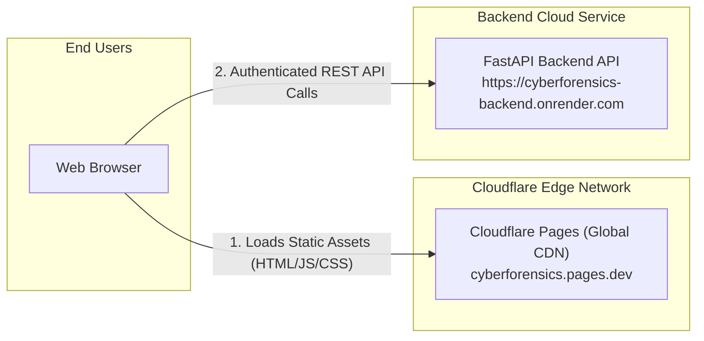

# ⚡ Deploying CyberForensics Frontend to Cloudflare Pages

This guide walks you through deploying the **CyberForensics React Frontend** to **Cloudflare Pages** for global edge CDN distribution with zero latency.

---

## 🏗️ Architecture on Cloudflare Pages



---

## 🚀 Step-by-Step Deployment Instructions

### Step 1: Push your latest code to GitHub
Make sure your latest code with `_redirects` and frontend updates is pushed to GitHub:
```powershell
git add .
git commit -m "Configure Cloudflare Pages deployment and redirects"
git push origin main
```

---

### Step 2: Create a Project in Cloudflare Dashboard
1. Log in to your **[Cloudflare Dashboard](https://dash.cloudflare.com/)**.
2. In the left sidebar, navigate to **Compute (Workers & Pages)** → **Pages**.
3. Click **Connect to Git** (or **Create application** → **Pages** → **Connect to Git**).
4. Select your GitHub repository: `PradebaN2007/CYBERFORENSICS-`.
5. Click **Begin setup**.

---

### Step 3: Configure Build & Environment Settings
Configure the build settings as follows:

| Setting | Value |
|---|---|
| **Project name** | `cyberforensics` (or your preferred name) |
| **Production branch** | `main` |
| **Framework preset** | `Vite` |
| **Root directory** | `frontend` |
| **Build command** | `npm run build` |
| **Build output directory** | `dist` |

#### Environment Variables:
Under **Environment variables (advanced)**, add:

| Variable Name | Value | Description |
|---|---|---|
| `NODE_VERSION` | `20` | Node runtime version |
| `VITE_API_BASE_URL` | `https://cyberforensics-backend.onrender.com/api` | Your deployed backend API URL |

> 💡 *Note: If your backend is deployed on Render or another cloud provider, paste its live URL into `VITE_API_BASE_URL`.*

---

### Step 4: Click Save and Deploy
1. Click **Save and Deploy**.
2. Cloudflare Pages will install dependencies, build the Vite production bundle, and deploy to their global edge network in ~30 seconds.
3. Your application will be live at:
   `https://cyberforensics.pages.dev` (or `<your-project-name>.pages.dev`).

---

## 🛡️ SPA Routing & Direct Link Support

The repository includes [`frontend/public/_redirects`](./frontend/public/_redirects) with:
```text
/*    /index.html   200
```
This ensures that refreshing or directly opening sub-routes like `https://cyberforensics.pages.dev/timeline`, `/evidence`, `/reports`, or `/investigation` loads smoothly without 404 errors.
